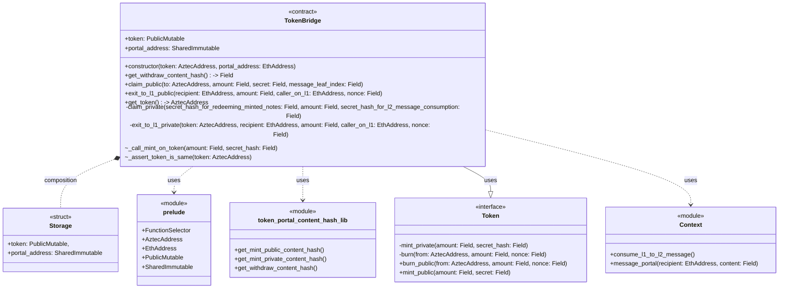

# Class Diagram

## L1 Contracts
Class diagram for the L1 contracts. The contracts are:
* TokenPortal
* PortalERC20

```mermaid
classDiagram
class TokenPortal{
    <<contract>>
    +registry: IRegistry
    +underlying: IERC20
    +l2Bridge: bytes32
    External(Below are all external functions)
    +initialize(_registry: IRegistry, _underlying: IERC20, _l2Bridge: bytes32)
    +depositToAztecPublic(_to: bytes32, _amount: uint256, _secretHash: bytes32)bytes32
    +depositToAztecPrivate(_secretHashForRedeemingMintedNotes: bytes32, _amount: uint256, _secretHashForL2MessageConsumption:bytes32)bytes32
    +withdraw(_recipient: address, _amount: uint256, _withCaller: bool, _l2BlockNumber: uint256, _leafIndex: uint256, _path: bytes32[])bytes32
}
class IRegistry {
    <<interface>>
    External(Below are all external functions)
    upgrade(_rollup: address, _inbox: address, _outbox: address)uint256
    getRollup()IRollup
    getVersion()uint256
    getInbox()IInbox
    getOutbox()IOutbox
    getSnapshot()DataStructures.RegistrySnapshot
    getCurrentSnapshot()DataStructures.RegistrySnapshot
    numberOfVersions()uint256
}
class IRollup {
    <<interface>>
    External(Below are external functions)
    process(_header: bytes, _archive: bytes, _proof: bytes)bytes32
    Public(Below are public functions)
    +L2BlockProcessed(blockNumber: uint256) %%event
}
class IOutbox {
    <<interface>>
    External(Below are external functions)
    insert(_l2BlockNumber: uint256, _root: bytes32, _height: uint256)
    consume(_message: DataStructures.L2ToL1Msg, _l2BlockNumber: uint256, _leafIndex: uint256, _path: bytes32[])
    hasMessageBeenConsumedAtBlockAndIndex(_l2BlockNumber: uint256, _leafIndex: uint256)bool
    Public(Public functions below)
    RootAdded(l2BlockNumber: uint256, root: bytes32, height: uint256) %%event
    MessageConsumed(l2BlockNumber: uint256, root: bytes32, messageHash: bytes32, leafIndex: uint256) %%event
}
class IInbox {
    <<interface>>
    External(External functions below)
    sendL2Message(_recipient: DataStructures.L2Actor, _content: bytes32, _secretHash: bytes32): bytes32
    consume()bytes32
    Public(Public functions below)
    +MessageSent(l2BlockNumber: uint256, index: uint256, hash: bytes32) %%event
}
class IERC20 {
    <<interface>>
    External(External functions below)
    transfer(_to: address, _value: uint256)bool
    balanceOf(_owner: address)uint256
    approve(_spender: address, _value: uint256)bool
    transferFrom(_from: address, _to: address, _value: uint256)bool
    allowance(_owner: address, _spender: address)uint256
    Public(Public functions below)
    +Transfer(from: address, to: address, value: uint256) %%event
    +Approval(owner: address, spender: address, value: uint256) %%event
}
class SafeERC20 {
    <<library>>
    -_callOptionalReturn(token: IERC20, data: bytes)
    -_callOptionalReturnBool(token: IERC20, data: bytes)bool
    ~safeTransfer(token: IERC20, to: address, value: uint256)
    ~safeTransferFrom(token: IERC20, from: address, to: address, value: uint256)
    ~safeIncreaseAllowance(token: IERC20, spender: address, value: uint256)
    ~safeDecreaseAllowance(token: IERC20, spender: address, requestedDecrease: uint256)
    ~forceApprove(token: IERC20, spender: address, value: uint256)
}
class RegistrySnapshot {
    <<struct>>
    version: uint256
    rollup: IRollup
    inbox: IInbox
    outbox: IOutbox
}
class L2Actor {
    <<struct>>
    actor: address
    version: uint256
}
class L1Actor {
    <<struct>>
    actor: address
    chainId: uint256
}
class L1ToL2Msg {
    <<struct>>
    sender: L1Actor
    recipient: L2Actor
    content: bytes32
    secretHash: bytes32
}
class L2ToL1Msg {
    <<struct>>
    sender: DataStructures.L2Actor
    recipient: DataStructures.L1Actor
    content: bytes32
}
class DataStructures {
    <<library>>

}
class Hash {
    <<library>>
    %%all functions below are internal
    ~sha256ToField(_message: DataStructures.L1ToL2Msg)bytes32
    ~sha256ToField(_message: DataStructures.L2ToL1Msg)bytes32
    ~sha256ToField(_data: bytes)bytes32
    ~sha256ToField(_data: bytes32)bytes32
}
class ERC20 {
    <<abstract>>
    -_balances: mapping
    -_allowances: mapping
    -_totalSupply: uint256
    -_name: string
    -_symbol: string
    ~_transfer(from: address, to: address, value: uint256)
    ~_update(from: address, to: address, value: uint256)
    ~_mint(account: address, value: uint256)
    ~_burn(account: address, value: uint256)
    ~_approve(owner: address, spender: address, value: uint256)
    ~_approve(owner: address, spender: address, value: uint256, emitEvent: bool)
    ~_spendAllowance(owner: address, spender: address, value: uint256)
    +constructor(name_: string, symbol_: string)
    +name(): string
    +symbol(): string
    +decimals(): uint8
    +totalSupply(): uint256
    +balanceOf(account: address): uint256
    +transfer(to: address, value: uint256): bool
    +allowance(owner: address, spender: address)uint256
    +approve(spender: address, value: uint256)bool
    +transferFrom(from: address, to: address, value: uint256)bool
}
class PortalERC20 {
    <<contract>>
    +mint(to: address, amount: uint256) %%external
    +constructor()
}

%%TokenPortal Interactions
TokenPortal --|> IRegistry: uses
TokenPortal ..> L2ToL1Msg: uses
TokenPortal --|> IERC20: uses
TokenPortal ..> SafeERC20: uses
TokenPortal ..> Hash: uses
%%IRegistry Interactions
IRegistry ..> IRollup: stores address for
IRegistry ..> IInbox: stores address for
IRegistry ..> IOutbox: stores address for
IRegistry ..> RegistrySnapshot
IRegistry ..> DataStructures: uses
%%IIInbox Interactions
IInbox ..> DataStructures
IInbox ..> L2Actor
%%IOutbox Interactions
IOutbox ..> L2ToL1Msg
IOutbox ..> DataStructures
%%RegistrySnapshot Interactions
RegistrySnapshot --* DataStructures: composition
%%L2Actor Interactions
L2Actor --* DataStructures: composition
%%L1Actor Interactions
L1Actor --* DataStructures: composition
%%L1ToL2Msg Interactions
L1ToL2Msg --* DataStructures: composition
L1ToL2Msg ..> L1Actor
L1ToL2Msg ..> L2Actor
%%L2ToL1Msg Interactions
L2ToL1Msg --* DataStructures: composition
L2ToL1Msg ..> L1Actor
L2ToL1Msg ..> L2Actor
%%SafeERC20 Interactions
SafeERC20 ..> IERC20
%%Hash Interactions
Hash ..> DataStructures
Hash ..> L1ToL2Msg
Hash ..> L2ToL1Msg
%%PortalERC20 Interactions
PortalERC20 --|> ERC20: is
%%ERC20 Interactions
ERC20 ..> IERC20

```

## L2 Contract
Class diagram for the L2 contract. The contract is:
* TokenBridge

