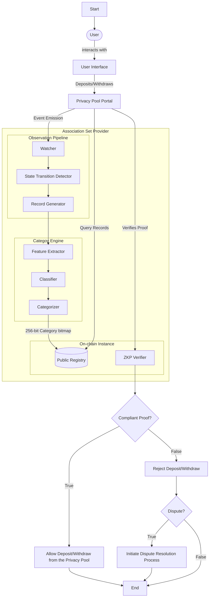

```mermaid
flowchart TD
    start[Start] --> User
    User([User]) --> |interacts with| UI[User Interface]
    UI --> |Deposits/Withdraws| PP[Privacy Pool Portal]
    PP --> |Event Emission| W[Watcher]
    
    subgraph ASP [Association Set Provider]
        subgraph OP [Observation Pipeline]
        W[Watcher] --> STD[State Transition Detector]
        STD --> RG[Record Generator]
        end
        subgraph CE [Categoy Engine]
        RG --> FE[Feature Extractor]
        FE --> CL[Classifier]
        CL --> CT[Categorizer]
        end
        subgraph OI [On-chain Instance]
        CT --> |256-bit Category bitmap| PR[(Public Registry)]
        ZKPV[ZKP Verifier]
        end
    end
    
    PP --> |Query Records| PR
    PP --> |Verifies Proof| ZKPV
    
    ZKPV --> CP{Compliant Proof?}
    CP --> |True| ATX[Allow Deposit/Withdraw from the Privacy Pool]
    CP --> |False| RTX[Reject Deposit/Withdraw]
    ATX --> END[End]
    RTX --> D{Dispute?}
    D --> |True| R[Initiate Dispute Resolution Process]
    R --> END
    D --> |False| END
    
```