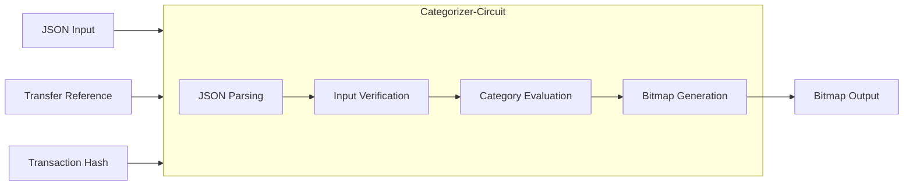

# Categorizer Circuit
This Noir circuit implements a zero-knowledge proof system for evaluating cryptocurrency transaction data against predefined risk categories, utilizing Chainalysis data. The main functionalities of the circuit are:

1. **JSON Parsing**: The circuit takes a JSON string input containing Chainalysis transaction data and parses it into a structured format.
2. **Input Verification**: It verifies the integrity of the input data, including checking for valid keys and matching public inputs (transaction hash and transfer reference) with the JSON data.
3. **Category Evaluation**: The core functionality of the circuit is to evaluate the Chainalysis transaction data against several predefined risk categories, including:

* Terrorism
* Scam
* Money Laundering
* Exploit
* Direct/Indirect OFAC (Office of Foreign Assets Control) concerns
* Direct/Indirect KYC (Know Your Customer) issues
* CEX (Centralized Exchange) involvement


4. **Bitmap Generation**: Based on the evaluation of Chainalysis data, the circuit generates a bitmap where each bit represents a specific risk category. This allows for efficient representation of multiple risk factors in a single output.
5. **Modular Design**: The circuit is designed with separate functions for each category evaluation, allowing for easy maintenance and potential expansion of risk categories based on Chainalysis classifications.
6. **Test Suite**: The code includes a comprehensive test suite to verify the correct functioning of each category evaluation and edge cases using sample Chainalysis data.

The circuit aims to provide a privacy-preserving way to assess the risk level of cryptocurrency transactions using Chainalysis data without revealing the specific details of the transaction, leveraging zero-knowledge proofs to enhance financial privacy while maintaining regulatory compliance.

The below diagram illustrates the flow of the categorizer circuit:



## Bitmap Category Description
The bitmap output generated by the categorizer circuit represents the risk categories associated with a given transaction. Each bit in the bitmap corresponds to a specific risk category, allowing for efficient representation of multiple risk factors in a single output. The following table provides a description of each risk category represented by the bitmap:
| Category   | Description |
| :--------: | :-------    |
| Terrorism  | Record is associated with terrorism, i.e. Wallets involved with the Value transferred may be indirectly or directly associated with terrorist organizations or activities. |
| Scam       | Record is associated with a scam, i.e. Assets transferred or Associated accounts are linked to a Pig Butchering scam. |
| Money Laundering    | Record is associated with Money Laundering. I.e. Assets transferred or Associated accounts were linked to money laundering. |
| Exploit    | Record is associated with an Exploit, i.e. Assets transferred or Associated accounts were linked to a hack or stolen funds. |
| Indirect OFAC | Record is associated with an Exploit, i.e. Assets transferred or Associated accounts were linked to a hack or stolen funds. |
| Direct OFAC | Assets transferred or Associated accounts were directly linked to wallets in the OFAC list. |
| Indirect KYC | At least one of the associated accounts held a valid KYC pass. |
| Direct KYC | All of the associated accounts held a valid KYC pass. |
| CEX | The src address is owned by a CEX. The asset transferred originated from a CEX wallet. |

## Chainalysis Category Description
The categorizer circuit evaluates cryptocurrency transaction data against predefined risk categories based on Chainalysis classifications. The following table provides a description of each risk category evaluated by the circuit:
| Category   | Description |
| :--------: | :-------    |
| Terrorist Financing | Terrorist financing involves funding terrorist groups, affiliates, and individuals. It's crucial for their survival, supporting activities like recruitment, propaganda, daily operations, and military actions. Terrorists secure funds through various means, including cryptocurrencies. |
| Scam | Scams mimic various crypto services, including exchanges and investment platforms. They often promise unrealistic returns, mask pyramid schemes, or use extortion tactics. Common forms include fake emails, fraudulent investment offers, and blackmail attempts threatening to disclose personal information. |
| Fraud Shop | Fraud shops are single-operator platforms selling stolen data, including personal information and financial details. Unlike multi-vendor darknet markets, these shops have unique characteristics such as top-up deposits and no customer withdrawals. This makes it easier to trace outgoing transactions to the shop operators. |
| ICO | ICOs (Initial Coin Offerings) are crowdfunding methods for new crypto projects, akin to traditional IPOs. Investors buy new tokens with fiat or established cryptocurrencies. While legitimate ICOs exist, many have been scams where fraudsters create convincing pitches, raise funds, then disappear with investors' money. |
| Mixing | Mixers are tools that obscure cryptocurrency transaction trails, used for privacy or concealing illicit fund movements. They work by pooling and redistributing funds from multiple users, breaking the link between original deposits and final withdrawals. This process can mask the source of funds from theft or darknet markets. |
| Seized Funds | Seized funds are assets confiscated by law enforcement agencies due to criminal activities. These funds are often held in wallets or exchanges, awaiting legal proceedings or return to victims. Seized funds can be linked to various crimes, including money laundering, fraud, and drug trafficking. |
| Gambling | Crypto gambling sites offer various games, from casino classics to sports betting. They've rapidly adopted cryptocurrencies for transactions. Due to varying regulations and often lax identity checks, these sites may be used for money laundering. Many operate from jurisdictions with lenient gambling laws, like certain island nations. |
| Special Measures | "Special measures" refers to entities or addresses flagged by FinCEN as primary money laundering concerns. Under Section 311 of the USA PATRIOT Act, FinCEN can impose various requirements or restrictions on these entities, including enhanced reporting or prohibiting certain financial transactions. This category may expand to include similar measures by other jurisdictions.|
| Stolen Funds | Stolen funds are assets obtained through theft, hacking, or fraud. These funds are often moved through multiple wallets or exchanges to obfuscate their origin. Stolen funds can be linked to various crimes, including ransomware attacks, phishing scams, and darknet market purchases. |
| Ransomware | Ransomware is malware that encrypts a victim's data and demands payment for decryption. Attackers use social engineering and phishing tactics to trick targets into downloading the malicious software. |
| Malware | Malware is software designed to harm or disrupt digital systems. It includes viruses, worms, trojans, and spyware. Malware can steal data, compromise security, destroy information, or hijack systems. It spreads through various means, including emails, downloads, and infected websites. |
| Sanctioned Jurisdiction | Sanctioned Jurisdictions are regions comprehensively sanctioned by OFAC, including Iran, North Korea, Cuba, Syria, Crimea, and the Donetsk/Luhansk regions. Venezuela is also included due to extensive government sanctions. This category covers cryptocurrency entities based in these areas and will be updated as new services are identified. |
| No KYC Exchange | No KYC Exchanges are centralized platforms that allow transactions without verifying user identity. They either collect no customer information or accept unverified basic details like name or email before permitting deposits or withdrawals.|
| Exchange | Exchanges are platforms for buying, selling, and trading cryptocurrencies. They are the most significant entities in the crypto industry, handling 90% of all service-based fund transfers. |
| Child Abuse Material | Child exploitation sites on the dark web facilitate the exchange of illegal content involving minors. These platforms are often heavily encrypted and require specific access methods. |
| Darknet Market | Darknet markets are hidden online black markets accessed via anonymizing software. They sell illicit goods using cryptocurrencies, with escrow and feedback systems for trust. Increased law enforcement has prompted tighter security measures.|
| Illicit Actor Org | Illicit actors are individuals or groups involved in illegal activities, either directly or indirectly. They're connected to high-risk entities like darknet markets, fraud shops, extremist financing, and hacking operations. |
| Sanctioned Entity | Sanctioned entities are individuals, organizations, or governments subject to financial restrictions by governments or international bodies. These restrictions aim to curb illicit activities, human rights abuses, or threats to national security. Sanctions can include asset freezes, travel bans, and trade embargoes. |

## Setup
1. Install Noir via Nargo. `nargo` is a tool for working with Noir programs on the CLI, providing you with the ability to start new projects, compile, execute and test Noir programs from the terminal.
Open a terminal on your machine, and write:
```bash
curl -L https://raw.githubusercontent.com/noir-lang/noirup/main/install | bash
```
2. Install Noir version v0.33.0
```bash
noirup --0.33.0
```
3. navigate to the `packages/circuits/categorizer` directory and run the following command to run the tests:
> [!NOTE]
> Do not run the tests via `nargo test` by itself, make sure you include the test function name i.e. `nargo test test_indirect_ofac`, otherwise it will run all tests and the application may potentially freeze.
```bash
nargo test name_of_the_test
```